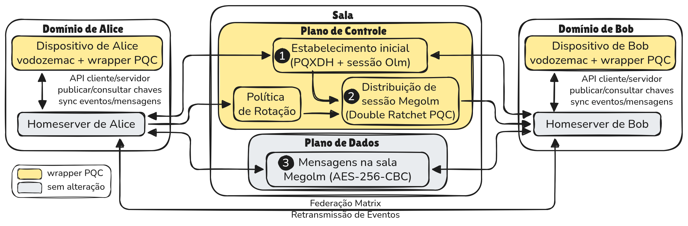

# Uma Extensão Pós-Quântica Híbrida para o Protocolo Matrix: Avaliação Experimental e Impacto Sistêmico

**Autores**: Marcos Ortiz (UFC), Vinícius Lagrota (CEPESC), Gilvan Maia (UFC), Rodrigo Pacheco (CEPESC), Paulo Rego (UFC)

**Artigo**: Submetido ao Simpósio Brasileiro de Redes de Computadores e Sistemas Distribuídos (SBRC 2026).

## Resumo

A computação quântica ameaça a criptografia assimétrica dos mensageiros com criptografia de ponta a ponta (E2EE), impulsionando a adoção de criptografia pós-quântica (PQC). Este estudo avalia a integração híbrida do CRYSTALS-Kyber no protocolo Matrix, estendendo o acordo de chaves (PQXDH com Kyber-1024) e o Double Ratchet (com Kyber-768) por meio de um *wrapper* sobre a biblioteca `vodozemac`. Testes experimentais com design pareado (30 repetições, 4 tipos de sala, 4 políticas de rotação) demonstram que o principal gargalo é a largura de banda, com overhead de +548% no *setup* e +252% nas rotações de chaves, enquanto o impacto na CPU e na experiência do usuário é negligenciável (≈16 ms a 100 ms por rotação). O custo das rotações escala como O(N × R), indicando que políticas de segurança rígidas tornam-se proibitivas em salas grandes e demandam estratégias adaptativas para equilibrar segurança temporal e consumo de rede.

---

# Estrutura do readme.md

1. [Selos Considerados](#selos-considerados)
2. [Informações Básicas](#informações-básicas)
3. [Wrapper PQC Proposto](#wrapper-pqc-proposto)
4. [Dependências](#dependências)
5. [Preocupações com Segurança](#preocupações-com-segurança)
6. [Instalação](#instalação)
7. [Teste Mínimo](#teste-mínimo)
8. [Experimentos](#experimentos)
   - [Reivindicação 1: Overhead de Largura de Banda no Plano de Controle](#reivindicação-1-overhead-de-largura-de-banda-no-plano-de-controle)
   - [Reivindicação 2: Overhead de Tempo de Processamento é Moderado e Negligenciável](#reivindicação-2-overhead-de-tempo-de-processamento-é-moderado-e-negligenciável)
   - [Reivindicação 3: Plano de Dados Inalterado](#reivindicação-3-plano-de-dados-inalterado)
   - [Reivindicação 4: Custos de Rotação Escalam como O(N × R)](#reivindicação-4-custos-de-rotação-escalam-como-on--r)
   - [Reivindicação 5: Trade-off Segurança Temporal vs Custo Operacional](#reivindicação-5-trade-off-segurança-temporal-vs-custo-operacional)
9. [LICENSE](#license)

---

# Selos Considerados

Este artefato foi preparado para concorrer aos seguintes selos de avaliação do SBRC 2026:

- **Disponíveis (SeloD)**: O código-fonte, os dados brutos e os scripts de análise estão disponíveis publicamente em repositório GitHub com licença aberta (AGPLv3).
- **Funcionais (SeloF)**: O artefato é completo, bem documentado e permite execução independente dos experimentos descritos no artigo.
- **Sustentáveis (SeloS)**: O código é modular, bem estruturado (traits, providers, módulos separados) e documentado para facilitar extensão e reutilização pela comunidade.
- **Reprodutíveis (SeloR)**: As instruções permitem reproduzir os resultados quantitativos do artigo, com análise estatística pareada automatizada (Wilcoxon signed-rank, intervalos de confiança a 95%, correção de Holm–Bonferroni).

---

# Informações Básicas

## Estrutura do Repositório

```
vodozemac-wrapper-pqc/
├── src/
│   ├── core/                          # Primitivas criptográficas fundamentais
│   │   ├── crypto.rs                  # Traits e definições de algoritmos (KEM, DH, Signature)
│   │   ├── pqxdh.rs                   # Protocolo PQXDH (3DH estendido com Kyber-1024)
│   │   ├── double_ratchet_pqc.rs      # Double Ratchet híbrido (X25519 + Kyber-768)
│   │   └── providers/
│   │       ├── classical.rs           # Provider clássico (vodozemac pura)
│   │       └── hybrid.rs              # Provider híbrido (vodozemac + CRYSTALS-Kyber)
│   │
│   ├── protocols/
│   │   └── room.rs                    # Salas Matrix (Olm + Megolm) com políticas de rotação
│   │
│   ├── demos/
│   │   └── user_profile_benchmark.rs  # Benchmark principal pareado (4 tipos de sala)
│   │
│   ├── tools/
│   │   └── workload.rs               # Gerador de carga de trabalho (distribuições acadêmicas)
│   │
│   ├── utils/
│   │   └── logging.rs                # Sistema de verbosidade (níveis 0–4)
│   │
│   ├── lib.rs                         # Biblioteca principal (re-exports)
│   └── main.rs                        # Interface CLI (clap)
│
├── scripts/
│   ├── analyze.py                     # Análise estatística pareada e geração de artefatos
│   └── requirements.txt               # Dependências Python
│
├── results/                           # Diretório de saída dos experimentos (CSVs)
├── tables_and_plots/                  # Gerado pelo script de análise (não versionado)
├── assets/                            # Imagens do README (figuras da arquitetura)
├── Cargo.toml                         # Configuração do pacote Rust e dependências
├── LICENSE                            # Licença AGPLv3
└── README.md                          # Este arquivo
```

## Design Experimental

O artefato implementa um **benchmark pareado**: cada configuração (tipo de sala × política de rotação) é executada em duas condições — *Classical* (apenas X25519) e *Hybrid* (X25519 + CRYSTALS-Kyber) — na mesma repetição, com ordem alternada para mitigar efeitos de cache e aquecimento.

| Fator                  | Níveis                                               |
|------------------------|------------------------------------------------------|
| Modo criptográfico     | Classical, Hybrid                                    |
| Tipo de sala           | DM (2 usuários), SmallGroup (7), MediumGroup (25), LargeChannel (150) |
| Perfil de salas        | 5 DM + 3 SmallGroup + 2 MediumGroup + 1 LargeChannel = 11 salas simultâneas |
| Política de rotação    | Paranoid (25 msgs), PQ3 (50), Balanced (100), Relaxed (250) |
| Carga de trabalho      | DM: 500 msgs · SmallGroup: 750 · MediumGroup: 1000 · LargeChannel: 1250 |
| Repetições             | 30 pares (60 execuções)                              |

As 11 salas simulam um perfil de usuário típico: a maioria das conversas é individual (DM), com participação decrescente em grupos à medida que o tamanho aumenta. A composição heterogênea permite avaliar como o overhead PQC escala com N (número de participantes) em condições realistas.

**Total de combinações**: 2 modos × 11 salas × 4 políticas × 30 repetições = **2640 execuções** (1320 pares Classical↔Hybrid), gerando 2640 linhas no CSV de saída.

## Métricas Coletadas

O CSV de saída contém **56 colunas** por linha (cada linha = uma sala em uma repetição), incluindo:

- **Timing (ms)**: `setup_time_ms`, `rotation_time_ms`, `encrypt_steady_state_ms`
- **Bandwidth (bytes)**: decomposição em 3 fases (Agreement, Initial Distribution, Rotation) × 3 origens (total, clássico, PQC)
- **Primitivas**: 12 métricas granulares de componentes (chaves Kyber, ciphertexts KEM, chaves Megolm, ratchet keys, overhead Olm)
- **Identificadores pareados**: `pair_id` para emparelhamento Classical↔Hybrid

---

# Wrapper PQC Proposto

O *wrapper* pós-quântico estende a biblioteca `vodozemac` com primitivas CRYSTALS-Kyber, concentrando o custo PQC exclusivamente no **plano de controle** — estabelecimento e rotação de chaves — sem alterar o tráfego de dados em sala (Megolm/AES-256-CBC).



A figura acima ilustra os três fluxos da arquitetura:

- **① Estabelecimento inicial (PQXDH + sessão Olm)**: O acordo de chaves entre dispositivos é estendido de 3DH para **PQXDH**, adicionando CRYSTALS-**Kyber-1024** ao ECDH clássico (X25519). O segredo híbrido resultante alimenta a chave-raiz do Double Ratchet Olm. Este fluxo ocorre uma vez por par de dispositivos ao entrar em uma sala.

- **② Distribuição de sessão Megolm (Double Ratchet PQC)**: A cada rotação de chave Megolm, a nova chave de sessão é redistribuída para cada receptor via canal Olm individual. Nesse momento, o Double Ratchet é estendido com CRYSTALS-**Kyber-768** — mais leve que o Kyber-1024 do setup —, incorporando material pós-quântico na atualização da chave-raiz. O custo PQC é amortizado: ocorre apenas nos eventos de rotação, não por mensagem.

- **③ Mensagens na sala (Megolm/AES-256-CBC — sem alteração)**: O tráfego de dados permanece inteiramente clássico. A cifração Megolm com AES-256-CBC simétrico não é modificada, mantendo overhead nulo no plano de dados.

## Modos de operação

| Modo | Acordo de chaves | Double Ratchet | Megolm |
|------|-----------------|----------------|--------|
| **Classical** | X25519 (3DH) | X25519 | AES-256-CBC |
| **Hybrid** | X25519 + Kyber-1024 (PQXDH) | X25519 + Kyber-768 | AES-256-CBC |

## Políticas de rotação de sessão Megolm

A frequência de rotação (fluxo ②) é controlada por política configurável, determinando o *trade-off* entre segurança temporal e custo operacional:

| Política | Intervalo (msgs) | Descrição |
|----------|-----------------|-----------|
| **Paranoid** | 25 | Máxima segurança temporal; maior overhead |
| **PQ3** | 50 | Equivalente à política do Apple iMessage |
| **Balanced** | 100 | Padrão Matrix |
| **Relaxed** | 250 | Eficiência prioritária; menor overhead |

O custo acumulado de rotações escala como **O(N × R)** — proporcional ao número de participantes (N) e ao número de rotações (R) — tornando políticas conservadoras proibitivas em salas grandes (ver Reivindicação 4).

## Implementação: módulos e fluxos

A seguir, cada arquivo-fonte é relacionado ao fluxo da arquitetura que implementa, com os tipos e funções principais.

### `src/core/crypto.rs` — Tipos e traits compartilhados

Define as abstrações comuns a ambos os modos (Classical e Hybrid):

- **`KemAlgorithm`** e **`KemChoice`**: enums que selecionam a variante Kyber (`Kyber512`, `Kyber768`, `Kyber1024`) usada no Double Ratchet após o handshake.
- **`CryptoProvider`**: trait que ambos os providers (`VodoCrypto`, `VodoCryptoHybrid`) implementam, garantindo que o código de benchmark e de sala seja idêntico para os dois modos — a única diferença está na implementação concreta do provider.
- Tipos de transferência de dados: `IdentityKeysExport`, `OneTimeKeyExport`, `OlmSessionHandle`, `MegolmOutbound`, `MegolmInbound`, `KeyAgreementStats` — usados para coletar as métricas de largura de banda gravadas no CSV.

### `src/core/pqxdh.rs` — Fluxo ①: Estabelecimento de canal Olm (PQXDH)

Implementa o protocolo PQXDH que substitui o 3DH clássico no handshake inicial entre dois dispositivos:

- **`MatrixUser`**: estrutura com chaves de identidade de longo prazo (Ed25519 para assinatura + Curve25519 para DH) e chaves Kyber-1024 para KEM.
- **`init_pqxdh`**: lado iniciador — executa 3–4 acordos X25519 DH *e* um encapsulamento **Kyber-1024**, combinando os segredos via HKDF-SHA-256 para derivar a chave-raiz da sessão Olm.
- **`complete_pqxdh`**: lado respondedor — desencapsula o ciphertext Kyber recebido, recalcula os mesmos DH e deriva a mesma chave-raiz.
- Segurança híbrida: se o Kyber for quebrado, o X25519 ainda protege; se o X25519 for quebrado por computador quântico, o Kyber protege. Ambos precisam ser comprometidos simultaneamente.

### `src/core/double_ratchet_pqc.rs` — Fluxo ②: Distribuição Megolm (Double Ratchet PQC)

Estende o Double Ratchet da vodozemac com material pós-quântico na atualização da chave-raiz:

- **Avanço simétrico** (mensagens consecutivas na mesma direção): apenas HMAC-SHA-256 sobre a *chain key* — **zero overhead PQC por mensagem**.
- **Avanço assimétrico** (mudança de direção / rotação Megolm): gera novas chaves X25519 + **Kyber-768**, executa DH + KEM, e combina os dois segredos via HKDF-SHA-256 para atualizar a *root key*. O Kyber-768 foi escolhido aqui por ser mais leve que o Kyber-1024 do handshake, amortizando o custo em operações recorrentes.
- **`ZeroizingKyber*Key`**: wrappers com `Drop` trait que zeroizam as chaves privadas Kyber na memória ao serem descartadas (pqcrypto-kyber não implementa `Zeroize` nativamente).
- Formato de mensagem compatível com Matrix: prefixo JSON `{"type":2,...}` identifica mensagens PQC; fallback automático para Base64 clássico.

### `src/core/providers/classical.rs` — Provider clássico (baseline)

**`VodoCrypto`**: wrapper direto sobre a `vodozemac` oficial, sem nenhuma extensão PQC.

- Implementa o trait `CryptoProvider` com 3DH + Double Ratchet clássico (apenas X25519).
- Serve como **baseline** do benchmark pareado: cada repetição executa o mesmo cenário com `VodoCrypto` e com `VodoCryptoHybrid`, e a diferença mede o overhead PQC.
- `kem_pub_opt: None` nas chaves de identidade exportadas — sinaliza ao protocolo que não há KEM público a publicar.

### `src/core/providers/hybrid.rs` — Provider híbrido (wrapper PQC)

**`VodoCryptoHybrid`**: o coração do wrapper — mesmo trait `CryptoProvider`, porém com PQXDH e Double Ratchet PQC ativados.

- No handshake, delega para `init_pqxdh` / `complete_pqxdh` de `pqxdh.rs`.
- Na distribuição de chaves Megolm (rotação), usa `double_ratchet_pqc.rs` para o avanço assimétrico com Kyber-768.
- **`derive_hybrid_root_key`**: função HKDF-SHA-256 que concatena o segredo X25519 e o segredo Kyber e extrai a chave-raiz de 32 bytes — implementa o princípio `Security = max(classical, pqc)`.
- O tráfego de dados Megolm (AES-256-CBC) passa inalterado pelo `GroupSession` da vodozemac — sem modificação no fluxo ③.

### `src/protocols/room.rs` — Orquestração: sala Matrix com políticas de rotação

Coordena os três fluxos dentro de uma sala simulada:

- **`RotationPolicy`** e **`RotationConfig`**: enum com as 4 políticas (`Paranoid`/25, `PQ3`/50, `Balanced`/100, `Relaxed`/250 mensagens) e sua conversão para parâmetros concretos de rotação.
- A sala mantém sessões Olm individuais para cada par de participantes (usando o provider configurado — Classical ou Hybrid), distribui as chaves Megolm via esses canais (fluxo ①+②), e cifra as mensagens de sala com Megolm/AES-256-CBC (fluxo ③).
- Instrumentação: cada operação registra bytes transmitidos e tempo decorrido nas structs de métricas (`KeyAgreementStats`) que são gravadas no CSV — separando explicitamente overhead de protocolo PQC vs. clássico.

---

# Dependências

## Software Necessário

| Dependência         | Versão Mínima | Finalidade                                    |
|---------------------|---------------|-----------------------------------------------|
| **build-essential** | —             | Compilador C/C++ e linker (gcc, make, etc.)    |
| **pkg-config**      | —             | Resolução de bibliotecas nativas               |
| **Rust (rustc)**    | 1.70+         | Compilação do wrapper criptográfico            |
| **Cargo**           | 1.70+         | Gerenciador de dependências Rust               |
| **Python**          | 3.8+          | Análise estatística dos resultados             |
| **pip**             | —             | Instalação de pacotes Python                   |
| **Git**             | 2.0+          | Clonagem do repositório                        |

> **Nota (VMs mínimas)**: Em instalações mínimas do Ubuntu/Debian, os pacotes `build-essential` e `pkg-config` podem não estar presentes. Sem eles, a compilação Rust falhará com `error: linker 'cc' not found`. Veja o Passo 1 da [Instalação](#instalação).

## Dependências Rust (gerenciadas automaticamente pelo Cargo)

As principais *crates* são baixadas e compiladas automaticamente:

| Crate                 | Versão | Descrição                                      |
|-----------------------|--------|-------------------------------------------------|
| `vodozemac`           | 0.9.0  | Biblioteca criptográfica oficial do Matrix       |
| `pqcrypto-kyber`      | 0.8    | CRYSTALS-Kyber (KEM pós-quântico)               |
| `x25519-dalek`        | 2.0    | X25519 ECDH (acordo de chaves clássico)         |
| `ed25519-dalek`       | 2.0    | Ed25519 (assinaturas digitais)                  |
| `aes`                 | 0.8    | AES-256-CBC (cifra simétrica Megolm)            |
| `hkdf`                | 0.12   | HKDF-SHA-256 (derivação de chaves)              |
| `hmac` / `sha2`       | 0.12 / 0.10 | HMAC-SHA-256 (autenticação de mensagens)  |
| `clap`                | 4.5    | Parsing de argumentos CLI                        |
| `chrono`              | 0.4    | Timestamps para nomes de arquivos               |
| `rand`                | 0.8    | Geração de números aleatórios criptográficos     |

> Lista completa em `Cargo.toml`.

## Dependências Python

Instaláveis via `pip`:

| Pacote       | Versão  | Finalidade                              |
|--------------|---------|------------------------------------------|
| `pandas`     | ≥ 2.0.0 | Manipulação de dados tabulares (CSV)     |
| `numpy`      | ≥ 1.24.0| Operações numéricas                      |
| `scipy`      | ≥ 1.10.0| Testes estatísticos (Wilcoxon, Shapiro)  |
| `matplotlib` | ≥ 3.7.0 | Geração de gráficos                      |
| `seaborn`    | ≥ 0.12.0| Visualizações estatísticas               |

---

# Preocupações com Segurança

Este artefato **não apresenta riscos de segurança** para o avaliador:

- **Sem acesso à rede**: toda a execução é local. Não há comunicação com servidores externos, APIs ou serviços de rede. As "salas Matrix" são simuladas inteiramente em memória.
- **Sem escalonamento de privilégios**: não requer permissões de superusuário (`sudo`). Compila e executa inteiramente em espaço de usuário.
- **Sem persistência de dados sensíveis**: chaves criptográficas são geradas em memória e descartadas ao final de cada repetição. Os CSVs contêm apenas métricas de desempenho (tempos, bytes, contagens).
- **Sem modificação do sistema**: não instala serviços, daemons ou modifica configurações do sistema. As dependências Rust são compiladas localmente em `target/` e as Python são instaláveis em ambiente virtual.
- **Código auditável**: todo o código-fonte é aberto e pode ser inspecionado antes da execução.

---

# Instalação

## Passo 1: Instalar dependências do sistema (Ubuntu/Debian)

```bash
sudo apt update
sudo apt install -y build-essential pkg-config git curl python3 python3-pip python3-venv
```

> Esses pacotes fornecem o compilador C (`gcc`), o linker (`cc`), e ferramentas necessárias para compilar crates Rust com código nativo (e.g., `pqcrypto-kyber`, `libc`). Em VMs mínimas, a ausência de `build-essential` causa o erro `linker 'cc' not found`.

## Passo 2: Instalar Rust (se necessário)

```bash
curl --proto '=https' --tlsv1.2 -sSf https://sh.rustup.rs | sh
source "$HOME/.cargo/env"
```

Verificar instalação:

```bash
rustc --version    # Deve retornar 1.70.0 ou superior
cargo --version    # Deve retornar 1.70.0 ou superior
```

## Passo 3: Clonar o repositório

```bash
git clone https://github.com/mdo-br/matrix_pqc.git
cd matrix_pqc
```

## Passo 4: Compilar o projeto

```bash
cargo build --release
```

A primeira compilação pode levar **3–5 minutos** (download e compilação de ~50 crates). O binário será gerado em `target/release/vodozemac-wrapper-pqc`.

## Passo 5: Instalar dependências Python

**Recomendado** — ambiente virtual (evita conflitos com o sistema):

```bash
python3 -m venv venv
source venv/bin/activate
pip install -r scripts/requirements.txt
```

Alternativamente, sem ambiente virtual:

```bash
python3 -m pip install -r scripts/requirements.txt
```

## Verificação rápida

```bash
# Verificar que o binário foi gerado
ls -lh target/release/vodozemac-wrapper-pqc

# Verificar ajuda do CLI
./target/release/vodozemac-wrapper-pqc --help
```

---

# Teste Mínimo

Este teste verifica que o artefato compila, executa e produz resultados válidos em **menos de 2 minutos**.

```bash
# Executar teste rápido (1 política, 5 repetições)
cargo run --release -- \
  --mode user-profile \
  --repetitions 5 \
  --rotation-policy balanced \
  --verbosity 1
```

### Resultado esperado

1. **Saída no terminal**: progresso indicando execução de 5 pares (Classical + Hybrid) para 11 salas (5 DM, 3 SmallGroup, 2 MediumGroup, 1 LargeChannel) com política Balanced.
2. **Arquivo CSV gerado** em `results/`:
   ```bash
   ls results/*.csv
   # Deve listar um arquivo como: results/resultados_experiment_1738410053.csv
   ```
3. **Validação do CSV** — deve conter 110 linhas de dados (5 repetições × 11 salas × 2 modos):
   ```bash
   wc -l results/*.csv
   # Esperado: 111 (110 dados + 1 cabeçalho)
   ```
4. **Análise estatística** — executar o script de análise:
   ```bash
   python3 scripts/analyze.py results/*.csv
   ```
   O script deve produzir tabelas comparativas, testes de significância, intervalos de confiança, figuras e tabelas do artigo sem erros.

### Critério de aprovação

- [x] Compilação sem erros
- [x] Arquivo CSV gerado com 56 colunas
- [x] Dados pareados (cada `pair_id` possui `repeat_id=0` e `repeat_id=1`)
- [x] Script de análise executa sem erros

---

# Experimentos

Esta seção descreve como reproduzir os resultados apresentados no artigo. O experimento completo corresponde à execução do benchmark pareado com **4 políticas de rotação × 30 repetições**.

## Execução completa

```bash
# Limpar resultados anteriores (opcional)
rm -f results/*.csv

# Executar benchmark completo (≈30–60 min dependendo do hardware)
time cargo run --release -- \
  --mode user-profile \
  --repetitions 30 \
  --all-rotation-policies \
  --verbosity 1
```

**Saída**: Um arquivo CSV único em `results/resultados_experiment_<timestamp>.csv` contendo 2640 linhas de dados (30 repetições × 11 salas × 4 políticas × 2 modos).

## Análise estatística automatizada

```bash
python3 scripts/analyze.py results/resultados_experiment_[TIMESTAMP].csv
```

O script realiza análise estatística e geração de artefatos do artigo em uma única execução:

**Parte 1 — Análise Estatística Pareada:**

1. **Bandwidth by Phase**: decomposição de largura de banda por fase (Agreement, Initial Distribution, Rotation, Megolm Messages)
2. **PQC Composition**: componentes de largura de banda das primitivas PQC
3. **Rotation Metrics**: impacto das políticas de rotação no overhead
4. **Time by Phase**: decomposição de tempo por fase
5. **Bandwidth × Time Correlation**: correlação entre overhead de banda e tempo

**Parte 2 — Geração de Artefatos do Artigo:**

6. **Figura 3**: Comparação de overhead BW vs Tempo por fase (`fig_overhead_comparison_bandwidth_time.png`)
7. **Figura 4**: Trade-off segurança vs custo para SmallGroup (`fig_policy_tradeoff_smallgroup.png`)
8. **Tabela 3**: Overhead detalhado por Fase × Sala × Política (`tab_detailed_phase_room_policy.tex`)

Os artefatos (2 figuras `.png` e 1 tabela `.tex`) são salvos no diretório `tables_and_plots/`, criado automaticamente pelo script.

Para cada métrica, aplica: teste de normalidade (Shapiro–Wilk), teste de significância (Wilcoxon signed-rank ou *t* pareado), intervalo de confiança a 95% e correção de Holm–Bonferroni para comparações múltiplas.

---

## Reivindicação 1: Overhead de Largura de Banda no Plano de Controle

**Reivindicação do artigo** (Seção 6.1): *"o impacto na largura de banda é substancialmente superior, atingindo 548% [no setup] [...] As operações de rotação de chaves apresentam um overhead moderado [...] +252% em banda"*.

### Como reproduzir

```bash
# 1. Executar benchmark completo (se ainda não executado)
cargo run --release -- \
  --mode user-profile \
  --repetitions 30 \
  --all-rotation-policies \
  --verbosity 1

# 2. Analisar resultados
python3 scripts/analyze.py results/resultados_experiment_[TIMESTAMP].csv
```

### Resultado esperado

Na saída do script, na análise **"Bandwidth by Phase"**, observar:

- **`bandwidth_agreement`** (plano de controle — acordo de chaves): overhead ≈ +2332% (*p* < 0,001) — reflete a adição das chaves CRYSTALS-Kyber-1024 ao acordo PQXDH
- **`bandwidth_initial_distribution`** (distribuição inicial Megolm): overhead ≈ +252% (*p* < 0,001) — reflete o Ratchet Key híbrido (X25519 + Kyber-768)
- **`bandwidth_rotation`** (rotações de chaves): overhead ≈ +252% (*p* < 0,001)
- **`bandwidth_megolm_messages`** (plano de dados): overhead ≈ 0% (sem diferença significativa)

> **Nota**: O artigo reporta +548% de overhead no *setup*, que corresponde ao **agregado** de Agreement + Initial Distribution (ratio de 6,48× reportado na seção "Correlação Bandwidth vs Tempo" do script). O script decompõe essas fases separadamente para maior granularidade.

### Variações aceitáveis

Os overheads percentuais são determinísticos para a parte de protocolo (tamanho de chaves e ciphertexts Kyber são fixos), portanto os valores devem convergir para os reportados. Pequenas variações (±5%) podem decorrer de diferenças na geração de carga de trabalho (distribuição aleatória de tipos de mensagens).

---

## Reivindicação 2: Overhead de Tempo de Processamento é Moderado e Negligenciável

**Reivindicação do artigo** (Seção 6.1): *"o overhead de tempo de rotações (~2,3× ou +133%) é significativamente menor que o de largura de banda [...] PQC não comprometeria a experiência de usuário em cenários típicos"* e *"A cada 50 mensagens, ocorre uma pausa de ≈16 ms para redistribuir a chave Megolm. Esse atraso é imperceptível em interações humanas."*

### Como reproduzir

```bash
python3 scripts/analyze.py results/resultados_experiment_[TIMESTAMP].csv
```

### Resultado esperado

Na análise **"Time by Phase"**, observar:

- **`setup_time_ms`**: overhead por tipo de sala (Hybrid adiciona operações PQXDH com Kyber-1024):
  - DM (N=2): ≈ +190%
  - SmallGroup (N=7): ≈ +217%
  - MediumGroup (N=25): ≈ +223%
  - LargeChannel (N=150): ≈ +221%
  - Intervalo: **+190% a +223%**
- **`rotation_time_ms`**: overhead por tipo de sala (rotações usam Kyber-768, mais leve):
  - DM (N=2): ≈ +98%
  - SmallGroup (N=7): ≈ +115%
  - MediumGroup (N=25): ≈ +142%
  - LargeChannel (N=150): ≈ +133%
  - Intervalo: **+98% a +142%**; agregado ≈ +133%
- **`encrypt_steady_state_ms`**: overhead ≈ 0% (Megolm AES-256 não é alterado)
- Em valores absolutos, o overhead por evento PQC varia de ≈16 ms (rotação individual em LargeChannel) a ≈100 ms (setup em salas grandes)

### Variações aceitáveis

Tempos absolutos variam conforme hardware (CPU, frequência, carga do sistema). Espera-se que os **overheads percentuais** sejam consistentes, enquanto valores absolutos podem diferir proporcionalmente à velocidade da CPU.

---

## Reivindicação 3: Plano de Dados Inalterado

**Reivindicação do artigo** (Seção 6.1): *"o plano de dados permanece virtualmente inalterado, uma vez que a criptografia Megolm, baseada em AES-256-CBC simétrico, não apresenta overhead em largura de banda ou tempo de processamento."*

### Como reproduzir

```bash
python3 scripts/analyze.py results/resultados_experiment_[TIMESTAMP].csv
```

### Resultado esperado

Nas análises de bandwidth e time, observar que as métricas `bandwidth_megolm_messages` e `encrypt_steady_state_ms` apresentam diferença Classical − Hybrid ≈ 0 com *p*-value não significativo (ou com IC contendo zero). Isso confirma que mensagens de usuário final não são penalizadas pela adoção de PQC.

### Variações aceitáveis

Diferenças na casa de unidades de byte ou frações de milissegundo são esperadas (ruído de medição) e devem ser estatisticamente não significativas.

---

## Reivindicação 4: Custos de Rotação Escalam como O(N × R)

**Reivindicação do artigo** (Seção 6.2): *"o overhead acumulado escala linearmente com o número de rotações — O(R) — e com o número de receptores — O(N) —, resultando em custo total O(N × R). Para 1.250 mensagens em Large/Paranoid (50 rotações × 149 receptores), o custo atinge 11,88 MB."*

### Como reproduzir

```bash
# 1. Executar e analisar
python3 scripts/analyze.py results/resultados_experiment_[TIMESTAMP].csv
```

### Resultado esperado

Na análise **"Rotation Metrics"** e **"Bandwidth by Phase"**, comparar os valores de `bandwidth_rotation` entre diferentes configurações:

- **DM (N=2)**: overhead de rotação ≈ dezenas de kB
- **SmallGroup (N=7)**: overhead de centenas de kB (Paranoid: ≈294 kB)
- **MediumGroup (N=25)**: overhead de centenas de kB a poucos MB
- **LargeChannel (N=150)**: overhead de vários MB (Paranoid: ≈11,88 MB)

A relação entre salas deve ser aproximadamente proporcional a N × R (número de participantes × número de rotações).

### Variações aceitáveis

Valores absolutos podem variar ligeiramente conforme a carga de trabalho aleatória, mas a **proporcionalidade** entre configurações deve ser mantida (razão Large/DM ≈ 300–400×).

---

## Reivindicação 5: Trade-off Segurança Temporal vs Custo Operacional

**Reivindicação do artigo** (Seção 6.2): *"Paranoid oferece janela de segurança de 25 mensagens, mas consome 293,9 kB de banda acumulada em rotações. Relaxed expande a janela 10× (250 mensagens) mas reduz o custo para 29,4 kB, um trade-off bidirecional de 10×."*

### Como reproduzir

```bash
python3 scripts/analyze.py results/resultados_experiment_[TIMESTAMP].csv
```

### Resultado esperado

Comparar as métricas de `bandwidth_rotation` entre políticas para SmallGroup:

| Política | Janela (msgs) | Banda de Rotação (overhead) |
|----------|---------------|-----------------------------|
| Paranoid | 25            | ≈ 294 kB                    |
| PQ3      | 50            | ≈ 147 kB                    |
| Balanced | 100           | ≈ 69 kB                     |
| Relaxed  | 250           | ≈ 29 kB                     |

A redução deve ser aproximadamente linear com o intervalo de rotação (10× mais relaxado → 10× menos banda).

### Variações aceitáveis

Valores absolutos de bandwidth devem convergir (±10%) para os reportados, pois o tamanho das primitivas é fixo. A proporcionalidade entre políticas deve ser precisa (razão Paranoid/Relaxed ≈ 10×).

---

## Ambiente de Referência

Os experimentos do artigo foram conduzidos no seguinte ambiente:

| Componente       | Especificação                      |
|------------------|------------------------------------|
| **CPU**          | Intel Core i7-1165G7 (11th Gen)    |
| **RAM**          | 16 GB                              |
| **SO**           | Ubuntu 24.04 LTS                   |
| **Rust**         | 1.70+ (edition 2021)               |
| **Python**       | 3.8+                               |

> **Nota**: Os resultados de tempo absoluto podem variar em hardware diferente. Os overheads percentuais e as relações de proporcionalidade entre configurações devem ser reprodutíveis em qualquer hardware moderno.

---

# LICENSE

Este projeto está licenciado sob **GNU Affero General Public License v3.0 (AGPLv3)**.

- [AGPLv3 License](https://www.gnu.org/licenses/agpl-3.0.html)
- [Arquivo LICENSE](./LICENSE) — cópia local da licença

---

# Links

- **Repositório**: https://github.com/mdo-br/matrix_pqc
- **Matrix Protocol**: https://matrix.org
- **Vodozemac**: https://github.com/matrix-org/vodozemac
- **CRYSTALS-Kyber (NIST PQC)**: https://pq-crystals.org/kyber/

---

# Contato

Para questões sobre os artefatos ou reprodução dos experimentos:

- Marcos Dantas Ortiz — mdo@ufc.br


